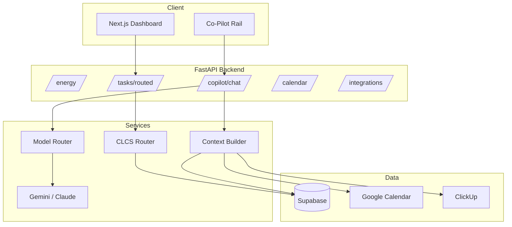

# Freeside

**Energy-aware productivity for freelancers and knowledge workers.**

Freeside is a cognitive load scheduling system that matches your work to how you actually feel today — not how your calendar pretends you should feel. It reads your Google Calendar and ClickUp workload, infers your available focus, routes tasks with the CLCS algorithm, and gives you an AI Co-Pilot that plans, splits, and reschedules work in your own language.

Built as a bachelor's thesis proof-of-concept and productized for B2C launch.

---

## Why Freeside exists

Most productivity tools treat every hour the same. Freeside doesn't. It uses **Cognitive Load Contextual Scheduling (CLCS)** to decide which tasks you should see right now, which should wait, and which need to be broken into smaller steps — based on your confirmed energy, peak-focus window, meeting load, and task difficulty.

The result: fewer overloaded days, less guilt from an impossible to-do list, and a system that protects deep work instead of filling every gap with admin.

---

## Core features

### Energy intelligence
- Morning check-in with AI-suggested energy from Google Calendar (+ ClickUp + recent Co-Pilot context)
- Manual override always available — you stay in control
- Per-user calibration learns the gap between AI suggestion and what you confirm

### CLCS task routing
- Every task has a cognitive load score (1–10)
- Routing compares task load to your **effective capacity** (energy + peak-hour boost)
- Tasks above capacity are deferred, not hidden — with clear "unlock when energy rises" messaging
- Goal-aligned and day-plan focus tasks get priority boosts

### AI Co-Pilot
- Live context on every turn: profile, calendar, ClickUp, energy history, today's metrics
- Responds in **your language** (Georgian, English, etc.) while keeping structured output parseable
- Detects tasks in conversation → proposes task cards → **confirm before write-back**
- Auto-split and reschedule heavy work when energy is low
- Energy profile surfaced as natural language, not raw scores

### Integrations
| Integration | Read | Write |
|-------------|------|-------|
| Google Calendar | Meetings, focus blocks, fragmentation metrics | Schedule focus blocks & deadlines (Premium) |
| ClickUp | Assigned tasks synced into your pool | Create/update tasks after Co-Pilot confirm |
| Goals & milestones | Multi-day planning with capacity forecast | — |

### Gamification & progress
- XP on task completion (scaled by cognitive load)
- Goal and milestone progress tracking
- "Tasks done" history and thesis-ready analytics export

### Burnout awareness *(Phase 4)*
- Rolling 14-day feature pipeline from energy, sleep, routing, and session logs
- Nightly risk score with plain-language insights
- Proactive Co-Pilot nudges when overload pattern detected

### Semantic memory *(Phase 3)*
- pgvector embeddings over goals, tasks, and Co-Pilot history
- Brain-dump items auto-linked to existing goals
- "Relevant history" injected into Co-Pilot context

---

## Pricing *(Phase 5 — B2C)*

| Tier | Price | Includes |
|------|-------|----------|
| **Free** | $0 | Manual energy, basic CLCS routing, limited task pool |
| **Pro** | $8–10/mo | AI energy inference, full Co-Pilot, goal decomposition, ClickUp, XP |
| **Premium** | $15–18/mo | Calendar write-back, burnout insights, priority support, more integrations |

Annual plans ~2 months free. Stripe Checkout + Customer Portal — no custom billing UI.

---

## Tech stack

| Layer | Technology |
|-------|------------|
| Frontend | Next.js (App Router), React, Tailwind CSS, Supabase Auth client |
| Backend | FastAPI, Python 3.11+, Uvicorn |
| Database | Supabase (PostgreSQL + Auth + RLS) |
| AI | Gemini 2.5 Flash / Flash-Lite, Claude Sonnet (Co-Pilot tier), model router with cost logging |
| Vectors | pgvector (embeddings on write) |
| Infra | Vercel (frontend), Railway/Fly (API), Supabase Pro at scale |

---

## Project structure

```
freeside/
├── frontend/          # Next.js app — dashboard, onboarding, settings, Co-Pilot rail
├── backend/
│   ├── routes/        # FastAPI routers (energy, tasks, copilot, calendar, integrations, …)
│   ├── services/      # Business logic — CLCS router, AI, context builder, integrations
│   ├── prompts/       # Co-Pilot system prompts
│   └── scripts/       # Manual test harnesses
├── database/
│   ├── schema.sql     # Base schema
│   └── migrations/    # Incremental SQL migrations
├── analysis/          # Thesis data analysis
└── thesis/            # Thesis document generation
```

---

## Getting started (development)

### Prerequisites
- Node.js 20+
- Python 3.11+
- Supabase project ([supabase.com](https://supabase.com))
- Google Cloud OAuth credentials (Calendar API)
- ClickUp OAuth app (optional)
- Gemini API key ([Google AI Studio](https://aistudio.google.com))

### 1. Database
Run `database/schema.sql` in Supabase SQL Editor, then apply migrations in `database/migrations/` in order.

### 2. Backend
```bash
cd backend
python -m venv .venv
source .venv/bin/activate   # Windows: .venv\Scripts\activate
pip install -r requirements.txt
cp .env.example .env        # fill in keys (see below)
uvicorn main:app --reload --port 8000
```

**`backend/.env` keys:**
```
SUPABASE_URL=
SUPABASE_SERVICE_KEY=
GEMINI_API_KEY=
GOOGLE_CLIENT_ID=
GOOGLE_CLIENT_SECRET=
CLICKUP_CLIENT_ID=
CLICKUP_CLIENT_SECRET=
BACKEND_URL=http://localhost:8000
FRONTEND_URL=http://localhost:3000
ENCRYPTION_KEY=
```

For OAuth/API token encryption, `ENCRYPTION_KEY` should match the Supabase/Postgres
key passed to the service-role vault RPCs. Hosted Supabase may reject custom
`ALTER DATABASE ... SET app.settings.*` parameters, so keep the key in backend
server-side env and run the one-time backfill RPC after applying the migration:

```sql
SELECT * FROM public.backfill_encrypted_oauth_tokens('<same-strong-random-key>');
```

### 3. Frontend
```bash
cd frontend
npm install
cp .env.local.example .env.local
npm run dev
```

**`frontend/.env.local`:**
```
NEXT_PUBLIC_SUPABASE_URL=
NEXT_PUBLIC_SUPABASE_ANON_KEY=
NEXT_PUBLIC_API_URL=http://localhost:8000
```

Open [http://localhost:3000](http://localhost:3000), sign up, complete onboarding, connect Calendar/ClickUp in Settings, set your energy, and start routing.

### Manual Co-Pilot test
```bash
cd backend
python scripts/test_freeside_copilot.py --user-id <your-supabase-uuid>
```

---

## Architecture overview



**Typical day flow:**
1. User opens dashboard → ClickUp tasks sync into pool
2. Energy check-in → AI infers score from calendar + workload → user confirms
3. `GET /tasks/routed` runs CLCS → active vs deferred tasks returned
4. Co-Pilot chat builds fresh `<freeside_context>` → suggests/splits/reschedules with confirm UX
5. Task completion → XP + session log + thesis analytics

---

## Implementation roadmap

Freeside is being built in six product phases (see `Freeside_Phased_Implementation_Pricing_Plan.md`):

| Phase | Focus | Status |
|-------|-------|--------|
| **0** | Trust & reliability — encryption, typed errors, tests, CI | In progress |
| **1** | Model tiering, structured output, cost logging | Partial (`model_router` exists) |
| **2** | Agentic Co-Pilot — tool-calling, confirm UX, calendar write | Partial (parsers + context; no confirm loop) |
| **3** | RAG over pgvector | Not started |
| **4** | Burnout prediction + personalization ML | Not started |
| **5** | B2C productization — Stripe, tiers, legal, PWA | Not started |
| **6** | Go-to-market — landing page, PostHog, launch | Not started |

**Current milestone:** complete Phase 0–1 foundation, then ship Phase 2 confirmation UX end-to-end.

---

## Research & thesis

Freeside is the implementation artifact for a bachelor's thesis on energy-aware task routing. The `analysis/` and `thesis/` folders contain export scripts, notebooks, and document generation. Session logs, routing logs, energy logs, and Co-Pilot usage are captured for empirical evaluation.

Key metrics: activation rate, D7 retention, routing accuracy (user completes vs reroutes), energy inference delta, Co-Pilot task acceptance rate.

---

## Security & privacy

- Row Level Security on all user tables
- OAuth tokens encrypted at rest with pgcrypto; backend access goes through service-role vault RPCs only
- Co-Pilot never writes to Calendar/ClickUp without explicit user confirmation
- Wellbeing-adjacent data (energy, sleep) covered by Privacy Policy + DPA (Phase 5)
- Service-role key server-side only — frontend uses anon key + user JWT

---

## License

Private / academic — contact maintainers for usage terms.

---

## Contributors

Built by Nini and the Freeside team as part of a bachelor's program. Contributions welcome once the repo opens for collaborators.
