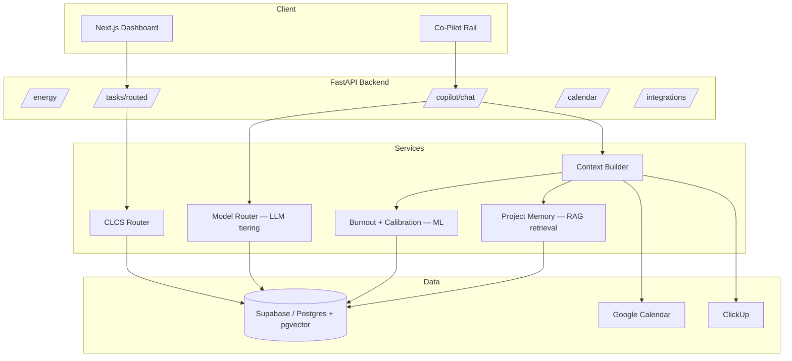

# Freeside

**Energy-aware productivity for freelancers, students, founders, and knowledge workers.**

Freeside is a full-stack AI productivity system that helps people plan their work around real cognitive energy, calendar load, goals, and project context — rather than a flat to-do list. It combines an energy-aware task router, a context-rich AI Co-Pilot, semantic project memory, Google Calendar and ClickUp integrations, goal and milestone planning, and wellbeing analytics into a single workflow.

Freeside began as a bachelor's thesis proof-of-concept and is now being productized as a B2C application for people who manage complex, self-directed work without the structure of a traditional team.

---

## What Freeside Does

Freeside is built around one question:

> *What should I realistically work on right now?*

Most productivity tools treat every task and every hour as equal. Freeside doesn't. It weighs the user's current energy, peak-focus window, meeting load, task difficulty, goals, and recent conversation context to decide what should be active, what should wait, and what should be broken into lighter pieces.

---

## Core Product Features

### Energy Check-In

Each day starts with a quick confirmation of cognitive energy, which drives everything downstream.

- Manual check-ins on a 1–10 scale, classified as low, balanced, or high
- AI-suggested energy inferred from Google Calendar, ClickUp workload, and recent Co-Pilot context
- Manual override always available — the user stays in control
- Per-user calibration that learns the gap between AI-suggested and confirmed energy over time
- Optional sleep logging for additional wellbeing context

### CLCS Task Routing

Freeside's core scheduling logic is a custom algorithm — Cognitive Load Contextual Scheduling (CLCS).

Every task carries a cognitive load score from 1 to 10, which CLCS compares against the user's effective capacity for the day. Routing accounts for:

- Confirmed energy score
- Peak-focus time boost
- Task cognitive load
- Goal alignment
- Day-plan focus
- Quick-win potential
- Existing milestone and task hierarchy

Based on this, CLCS returns:

- Active tasks that fit current capacity
- Deferred tasks that require more energy, with unlock scores
- Explanations for why a task was rerouted
- Milestone task groupings
- Future tasks that unlock as capacity changes

### Task Management

Standard task workflows are extended with AI assistance throughout.

- Create, edit, and delete tasks, including title, description, and cognitive load
- Complete tasks and earn XP scaled to difficulty
- View completed task history
- Split difficult tasks into subtasks, with blocked and doable subtasks shown separately
- Review tasks routed by current energy level

### Brain Dump Parsing

Users can paste an unstructured list of everything on their mind, and Freeside turns it into structured tasks.

- Extracts concrete, actionable tasks from free text
- Assigns cognitive load scores automatically
- Removes duplicates and vague or non-actionable items
- Suggests links to semantically similar existing goals
- Lets users review and select which extracted tasks to save

### Goals and Milestones

Freeside supports multi-day planning through a goal → milestone → task hierarchy.

- Up to three active goals at a time
- AI-generated milestone proposals for each goal
- Schedule preview across predicted energy capacity
- User confirmation required before milestones are saved
- Goal and milestone progress tracking
- Milestones broken into child tasks, which route through CLCS like any other task

The goal planner draws on the user's profile, work style, peak focus time, energy history, and calendar availability, using AI-driven decomposition with a rule-based fallback when AI quota is unavailable.

### AI Co-Pilot

The Co-Pilot is a context-aware planning assistant built around the user's actual, current work state — not a generic chat interface.

It can:

- Answer planning questions and suggest what to work on today
- Generate task cards, milestones, and child tasks
- Break tasks into micro-steps
- Adjust suggestions to current energy
- Respond in the user's language, including Georgian and English
- Use recent conversation history as context
- Return structured output the UI can parse directly
- Propose actions for confirmation rather than writing them back automatically

Each Co-Pilot turn is grounded in a live context bundle covering the user's profile, energy history, Google Calendar data, ClickUp tasks, active goals, pending tasks, recent Co-Pilot turns, semantic memory, and burnout risk.

### Project Memory and Planning Agent

Project Memory is Freeside's RAG-powered planning layer.

Users can paste in messy work context — client briefs, product notes, thesis notes, meeting summaries, requirements, personal project plans, or brainstorming notes — and Freeside stores it as chunked, embedded memory tied to their account.

From there, users can ask planning questions such as:

- "What should I move forward next?"
- "What am I forgetting?"
- "Turn this project context into milestones."
- "What can I do with low energy today?"
- "Which parts are blocked?"

The Project Memory agent retrieves the most relevant stored context for the question, then returns a grounded answer that references the specific notes it drew from, along with concrete suggested next actions, milestones, or task links back into the user's existing goals — rather than a generic response disconnected from their actual project state.

---

## Technical Architecture

Freeside is not a single AI feature bolted onto a task app — it combines three distinct AI/ML techniques, each solving a different problem, wired together through one backend.

| Technique | Where it's used | Why it's used |
|---|---|---|
| **LLM (Large Language Model)** | Co-Pilot chat, brain-dump parsing, milestone decomposition, energy inference | Natural-language understanding and generation — turning unstructured input (chat, pasted notes) into structured, actionable output |
| **RAG (Retrieval-Augmented Generation)** | Project Memory | Grounding LLM answers in the user's *own* stored context (briefs, notes, past tasks) instead of relying on the model's general knowledge or a limited context window |
| **ML (Machine Learning)** | Energy calibration, burnout risk prediction | Learning per-user patterns from structured historical data — something an LLM prompt alone cannot reliably do across many users at low cost |

These are used for different jobs on purpose: the LLM handles anything requiring language understanding, RAG handles anything requiring "remember what this specific user told me weeks ago," and ML handles anything requiring statistical pattern-learning over structured logs. Below is what each looks like in the implementation, and where each currently stands against the roadmap.

> **Implementation status:** the LLM layer (model router, Co-Pilot, brain-dump parsing) is implemented and partially in progress per the roadmap below. RAG (Project Memory) and the ML layer (burnout prediction, energy calibration) are architected and specified but not yet built — see [Implementation Roadmap](#implementation-roadmap), Phases 3–4. The descriptions below reflect the target design for all three, called out explicitly so this section can be read as the technical specification, not a claim of what's already shipped.

### 1. LLM layer — Co-Pilot and generation tasks

All generative features (Co-Pilot chat, brain-dump parsing, milestone proposals, AI-suggested energy) route through a central **model router** rather than calling a model API directly from each feature.

- **Tiered model selection.** The router maps each task type to a cost/capability tier — lightweight tasks (energy inference, quick parsing) use a fast, cheap model; complex reasoning (multi-turn Co-Pilot conversations, goal decomposition) is routed to a stronger model. This keeps per-request cost proportional to task complexity instead of using the most expensive model for everything.
- **Structured output enforcement.** LLM responses that feed the UI (task cards, milestone proposals) are requested as JSON and validated against a defined schema before being used, since the UI parses these responses programmatically rather than displaying raw text.
- **Cost logging.** Every model call is logged (model used, tokens, task type) to support the thesis's empirical cost/quality analysis across task types and model tiers.
- **Confirm-before-write.** The Co-Pilot never writes to Calendar or ClickUp directly from an LLM response — it proposes an action, and the write only happens after explicit user confirmation. This keeps a non-deterministic model out of the direct write path to external systems.

### 2. RAG layer — Project Memory

Project Memory answers planning questions ("What am I forgetting?", "Turn this into milestones") using the user's own stored context rather than the LLM's general knowledge.

Pipeline:

1. **Ingest** — user pastes unstructured context (brief, notes, meeting summary).
2. **Chunk** — text is split into retrievable chunks sized for the embedding model.
3. **Embed** — each chunk is converted into a vector embedding and stored per-user in a vector column (pgvector on Postgres/Supabase).
4. **Retrieve** — on a new question or Co-Pilot turn, the query is embedded and compared against stored vectors via similarity search to pull the most relevant chunks for that specific user only.
5. **Generate** — the retrieved chunks are injected into the LLM prompt alongside the user's live context (calendar, energy, tasks), so the answer is grounded in what the user actually wrote, not a hallucinated guess.

This same embedding pipeline also powers semantic goal-matching in brain-dump parsing: a new item is embedded and compared against existing goals before deciding whether to link it or create a new one, reducing duplicate goals from near-identical phrasing.

**Data isolation matters here specifically:** because retrieval runs through a service-role connection, similarity search is always scoped to the requesting user's own vectors — one user's project notes are never retrievable in another user's context.

### 3. ML layer — Personalization and burnout prediction

This layer is separate from the LLM entirely — it's a supervised learning problem over structured logs, not a language task.

- **Energy calibration.** Every energy check-in logs both the AI-suggested score and the user's confirmed score. A running per-user bias term is computed from the historical gap between the two, and future AI suggestions are adjusted by that bias — so the system's energy inference gets more accurate for that specific person over time, rather than staying static.
- **Burnout risk pipeline.** A rolling feature window (default 14 days) is built per user from energy logs, sleep logs, task-routing logs, and session logs — capturing signals like energy trend, task reroute rate, and task-abandonment rate. A baseline classifier trained on this feature set produces a burnout risk score, refreshed on a nightly schedule and surfaced back into the Co-Pilot's context so it can proactively suggest a lighter day — always as a suggestion, never a restriction, consistent with the manual-override principle used throughout the product.
- **Why ML rather than an LLM prompt for this:** burnout risk depends on trends across dozens of structured data points per user over time, which is a poor fit for a prompt-based approach and well suited to a lightweight trained classifier that runs cheaply and consistently at scale.

### Architecture overview



### Tech stack

| Layer | Technology |
|---|---|
| Frontend | Next.js (App Router), React, Tailwind CSS, Supabase Auth client |
| Backend | FastAPI, Python 3.11+, Uvicorn |
| Database | Supabase (PostgreSQL + Auth + Row Level Security) |
| LLM | Gemini 2.5 Flash / Flash-Lite for lightweight tasks; Claude Sonnet for the higher-reasoning Co-Pilot tier; routed via a cost-aware model router |
| RAG | pgvector for embeddings, chunked ingestion, per-user similarity retrieval |
| ML | scikit-learn baseline classifier for burnout risk; custom per-user calibration for energy inference |
| Infra | Vercel (frontend), Railway/Fly (API), Supabase Pro at scale |

### Security posture relevant to the above

Since RAG and ML both work over sensitive behavioral data (chat history, energy, sleep patterns), the same account-level protections apply throughout:

- Row Level Security on every user-owned table, including embeddings and burnout scores
- OAuth tokens encrypted at rest, decrypted only via a service-role-only path
- All retrieval and inference scoped strictly to the requesting user's own data
- Wellbeing-adjacent data (energy, sleep, burnout scores) treated as sensitive and covered under the product's privacy policy

---

## Implementation Roadmap

Freeside is being built in six phases:

| Phase | Focus | Status |
|---|---|---|
| **0** | Trust & reliability — encryption, typed errors, tests, CI | In progress |
| **1** | Model tiering, structured output, cost logging | Partial (model router exists) |
| **2** | Agentic Co-Pilot — tool-calling, confirm UX, calendar write-back | Partial (parsers + context built; confirm loop pending) |
| **3** | RAG over pgvector (Project Memory) | Not started |
| **4** | Burnout prediction + ML personalization | Not started |
| **5** | B2C productization — Stripe, tiers, legal, PWA | Not started |
| **6** | Go-to-market — landing page, analytics, launch | Not started |

**Current milestone:** complete the Phase 0–1 foundation, then ship Phase 2's confirmation UX end-to-end before moving into RAG and ML.

---

## Getting Started (Development)

### Prerequisites

- Node.js 20+
- Python 3.11+
- A Supabase project ([supabase.com](https://supabase.com))
- Google Cloud OAuth credentials (Calendar API)
- A ClickUp OAuth app (optional)
- A Gemini API key ([Google AI Studio](https://aistudio.google.com))

### 1. Database

Run `database/schema.sql` in the Supabase SQL Editor, then apply the migrations in `database/migrations/` in order.

### 2. Backend

```bash
cd backend
python -m venv .venv
source .venv/bin/activate   # Windows: .venv\Scripts\activate
pip install -r requirements.txt
cp .env.example .env         # fill in keys below
uvicorn main:app --reload --port 8000
```

**`backend/.env` keys:**

```
SUPABASE_URL=
SUPABASE_SERVICE_KEY=
GEMINI_API_KEY=
GOOGLE_CLIENT_ID=
GOOGLE_CLIENT_SECRET=
CLICKUP_CLIENT_ID=
CLICKUP_CLIENT_SECRET=
```
